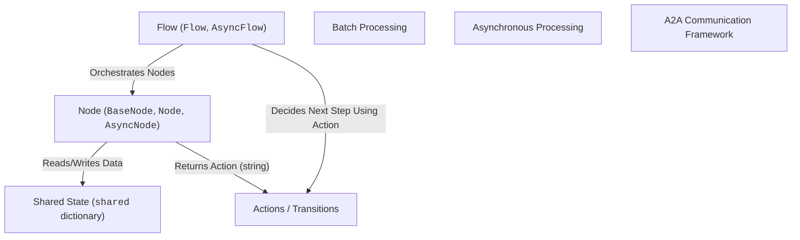
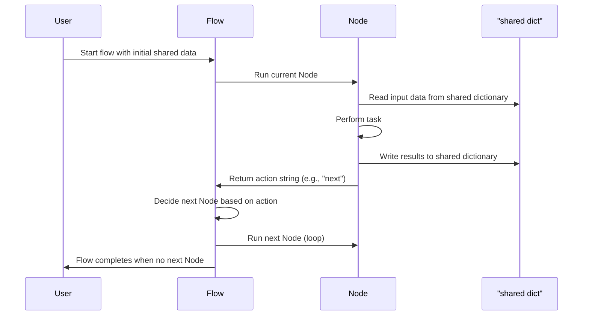

# Chapter 1: PocketFlow Overview and Ecosystem

Welcome to PocketFlow! In this chapter, we'll explore what PocketFlow is, why it exists, and how it helps you build smart AI systems by combining simple building blocks.

---

## Why PocketFlow? The Problem It Solves

Imagine you want to create an AI assistant that can:

- Listen to your question.
- Search the web for relevant info.
- Use a language model to generate a helpful answer.
- Summarize the answer nicely.

Sounds simple, right? But under the hood, this involves many steps, different tools, and tons of data moving around. Writing all this as one big program gets complicated, hard to maintain, and tricky to expand.

**PocketFlow solves this by breaking your AI system into small, reusable parts called Nodes**. Each Node does one simple task, like "search the web" or "ask the language model."

Then, you connect these Nodes in a Flow that guides what happens next, passing information along neatly. It’s like building with LEGO blocks—you build complex things by snapping together simple pieces.

---

## The Big Picture: PocketFlow's Core Concepts

Let's dive into the main ideas that make PocketFlow tick.



### 1. Nodes: The Tiny Workers

- **What are they?**  
  Nodes are small pieces of code that do one specific task, like calling an API or processing text.

- **How do they work?**  
  Each Node runs, reads some inputs from a shared data store, does its job, and writes results back into it.

- **Types of Nodes:**  
  - `BaseNode`: The minimal Node you can extend.  
  - `Node`: A basic synchronous task performer.  
  - `AsyncNode`: Handles asynchronous jobs (like waiting for a web request).

### 2. Flow: The Boss Organizing Everything

- **What is it?**  
  The Flow directs how Nodes run in sequence or in parallel.

- **How does it do that?**  
  By using **Actions** that Nodes return to decide what happens next. Think of it as a choose-your-own-adventure guide for your AI workflow.

### 3. Shared State: The Common Whiteboard

- This is a Python dictionary called `shared` where Nodes read inputs from and write outputs to. It keeps the data flowing smoothly between tasks.

### 4. Advanced Features

PocketFlow also supports:

- **Batch Processing:** Run tasks over lists of items efficiently.  
- **Asynchronous Processing:** Handle tasks that don’t block the program (like web calls).  
- **A2A Communication Framework:** Wraps your PocketFlow agents so they can talk to other systems via a standard protocol.

---

## How PocketFlow Helps Build AI Workflows — A Simple Example

Let's say you want to create a mini workflow that:

1. Takes a user's question.
2. Passes it to a Node that "pretends" to search the web (for now).
3. Passes results to another Node that "pretends" to answer the question.

```python
# Node that "searches" based on a query
class SearchNode(Node):
    def run(self, shared):
        query = shared.get("question")
        # pretend search and return result
        shared["search_results"] = f"Results for '{query}'"
        return "next"

# Node that "answers" based on search results
class AnswerNode(Node):
    def run(self, shared):
        results = shared.get("search_results")
        shared["answer"] = f"Answer based on: {results}"
        return "done"

# Flow chaining the two nodes
flow = Flow(
    start_node=SearchNode(),
    transitions={
        "next": AnswerNode(),
        "done": None,  # end flow
    }
)

# Shared state starts with the question
shared = {"question": "What is PocketFlow?"}

# Execute flow (conceptual)
flow.run(shared)

print(shared["answer"])
```

> **What happens here?**  
> - `SearchNode` reads the question, puts fake search results in shared state, and returns `"next"`  
> - Flow uses `"next"` action to run `AnswerNode`  
> - `AnswerNode` creates an answer, stores it, and returns `"done"` to stop  
> - Finally, the answer is printed out.

---

## What Happens Inside PocketFlow? A Simple Step-by-Step

When you run a PocketFlow workflow:



---

## A Peek Under the Hood: How Nodes and Flows Work (Simplified)

### Node Example (`node.py`):

```python
class BaseNode:
    def run(self, shared):
        # Placeholder for actual task
        raise NotImplementedError
```

- **What happens?**  
  You create your own Node by inheriting from `BaseNode` and overriding `run()`.  

### Flow Example (`flow.py`):

```python
class Flow:
    def __init__(self, start_node, transitions):
        self.current_node = start_node
        self.transitions = transitions

    def run(self, shared):
        while self.current_node is not None:
            action = self.current_node.run(shared)
            self.current_node = self.transitions.get(action)
```

- **How does it manage Nodes?**  
  The Flow holds the current Node and a dictionary of transitions, mapping Actions (strings like `"next"`) to the next Node to run.

- **How do they work together?**  
  The Flow calls the current Node’s `run()` method, gets an Action, updates the current Node, and repeats until there’s no next Node.

---

## Summary

In this chapter, you learned:

- Why breaking AI workflows into small, connected pieces helps build complex applications easily.
- The main concepts in PocketFlow: **Nodes**, **Flow**, **Shared State**, and **Actions**.
- How a simple workflow runs step-by-step, passing data and control between Nodes.
- The powerful modularity and clarity PocketFlow offers, like building machines from well-designed parts.


Next up, we’ll get hands-on with how **Shared State (`shared` dictionary)** works and how Nodes exchange information through it.

[Next Chapter: Shared State (`shared` dictionary)](02_shared_state___shared__dictionary__.md)

---

Welcome aboard, and get ready to build your own AI workflows with PocketFlow!

---

Generated by [AI Codebase Knowledge Builder](https://github.com/The-Pocket/Tutorial-Codebase-Knowledge)