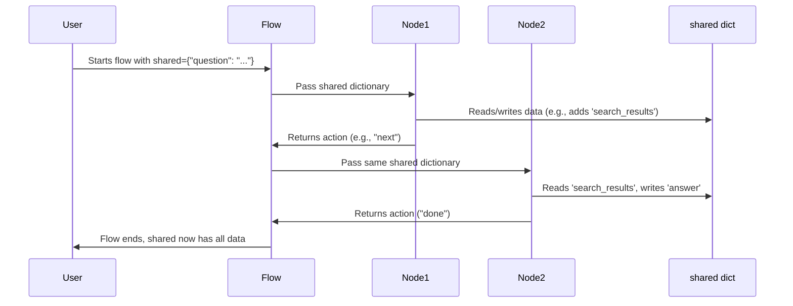

# Chapter 2: Shared State (`shared` dictionary)

Welcome back! In [Chapter 1: PocketFlow Overview and Ecosystem](01_pocketflow_overview_and_ecosystem_.md), we introduced you to PocketFlow's big picture and its building blocks like Nodes, Flows, and Actions. Now let’s zoom in on one of the most important pieces that allow these components to work together smoothly: the **Shared State**, also called the **`shared` dictionary**.

---

## Why Do We Need a Shared State?

Imagine building a baking team—one person mixes ingredients, another bakes, and the last decorates the cake. They all need to share information: what ingredients were used, how long it was baked, and what decoration style to apply.

In a PocketFlow workflow, different **Nodes** are these team members, each performing a step like “fetch data,” “process data,” or “generate response.” But how do they share results or context? That’s exactly what the **`shared` dictionary** is for — a communal message board where Nodes post and read data to keep everyone on the same page.

---

## What is the `shared` Dictionary?

- The `shared` dictionary is simply a **Python dictionary** (`dict`).
- It acts like a **relay baton** given from one Node to the next, carrying all the accumulated info.
- It lives **throughout one run of your Flow**, available to every Node.
- Nodes **read from it** to get inputs or context.
- Nodes **write to it** to save outputs or update the workflow’s state.

---

## Simple Example: Passing Data Between Nodes Using `shared`

Let's look at a tiny PocketFlow setup with two Nodes sharing info through `shared`.

```python
class NodeA:
    def run(self, shared):
        # Read input from shared
        name = shared.get("name", "Unknown")
        # Write something new into shared
        shared["greeting"] = f"Hello, {name}!"
        return "next"

class NodeB:
    def run(self, shared):
        # Read what NodeA wrote
        greeting = shared.get("greeting", "")
        shared["farewell"] = greeting + " Goodbye!"
        return "done"

# Start the shared dictionary with initial data
shared = {"name": "Alice"}

# Simulate running Nodes in sequence
node_a = NodeA()
node_b = NodeB()

action = node_a.run(shared)
if action == "next":
    node_b.run(shared)

print(shared)
```

**What happened here?**

- We started with `shared` holding `{"name": "Alice"}`.
- `NodeA` read the name, created a greeting, and saved it in `shared`.
- `NodeB` read the greeting and added a farewell message.
- Finally, when we print `shared`, it contains all info:

```python
{
  'name': 'Alice',
  'greeting': 'Hello, Alice!',
  'farewell': 'Hello, Alice! Goodbye!'
}
```

This simple example shows how the `shared` dictionary acts like a common notebook where Nodes write notes and read what others have said.

---

## Key Concepts of `shared`

Let's understand some important aspects:

### 1. **Starts with Initial Data**

Before starting, you fill `shared` with what you know:

```python
shared = {"question": "What is PocketFlow?"}
```

This is like putting your note in the notebook for others to read.

### 2. **Nodes Read and Write Data**

Each Node can:

- Get data: `value = shared.get("key")`
- Add or update data: `shared["new_key"] = "some_value"`

### 3. **Data is Persistent During a Flow**

As your PocketFlow runs, every change made to `shared` stays and is seen by following Nodes.

### 4. **Each Flow Run Has Its Own `shared`**

If you run two workflows at the same time, each will have its own `shared`. Changes in one do not affect others.

---

## How Does `shared` Help Solve Real Problems?

### Use Case: Building an AI Assistant

Steps might be:
1. Get a user's question.
2. Search for related info online.
3. Generate an answer using the search results.
4. Summarize the answer.

How do these steps share info about the question, search results, and answer?

**Answer:** Using the `shared` dictionary!

```python
shared = {"question": "Who won the Nobel Prize in Physics 2024?"}
```

- The **search Node** reads `"question"` from `shared` and adds `"search_results"`.
- The **answer Node** reads `"search_results"` and writes `"answer"`.
- The **summarize Node** reads `"answer"` and writes `"summary"`.

Each one builds upon the previous data by reading and writing to `shared`.

---

## A Closer Look: What Happens Under The Hood?

When you run a Flow with Nodes, PocketFlow internally handles passing that same `shared` dictionary from one Node to the next without you worrying about it. Here’s the simplified flow:



This means:

- The **same Python dictionary** flows through every Node.
- Nodes do not get copies—they access and modify the same object.
- Changes made by one Node are visible to the next immediately.

---

## Peek Into The Code

Here’s a small snippet from Node execution to show how `shared` is used:

```python
class BaseNode:
    def run(self, shared):
        input_data = shared.get("input")
        # Do some work with input_data
        result = input_data + " processed"
        shared["output"] = result
        return "next"
```

- The Node reads `"input"` from `shared`.
- It processes the `input_data` and stores the result under `"output"`.
- Returns an action string like `"next"` to tell Flow what to do next.

No complicated data passing—just plain dictionary usage!

---

## Analogies to Remember

- **Relay Race Baton:** Each runner (Node) grabs the baton (`shared`), adds something new, then passes it on.
- **Shared Notebook:** Everyone notes their progress and reads what others have written.
- **Team Chat:** Nodes communicate by posting messages in this shared chat room.

---

## Summary

In this chapter, you learned:

- The **`shared` dictionary** is PocketFlow’s primary way to exchange data between Nodes during a workflow.
- It acts like a **communal message board** where Nodes put, read, and update information.
- Using `shared`, your AI workflows can pass questions, intermediate results, and final answers seamlessly.
- It's just a normal Python dictionary that travels through your Flow unchanged, letting Nodes collaborate easily.
- PocketFlow takes care of passing this dictionary for you—it’s part of the framework’s magic!

---

## What’s Next?

Now that you know how Nodes talk and share information through the `shared` dictionary, it’s time to learn **about the Nodes themselves**—the tiny workers that make the magic happen.

Check out [Chapter 3: Nodes (`BaseNode`, `Node`, `AsyncNode`)](03_nodes___basenode____node____asyncnode___.md) to continue building your PocketFlow skills!

---

Welcome again to this exciting journey of building smart, modular AI workflows with PocketFlow!

---

Generated by [AI Codebase Knowledge Builder](https://github.com/The-Pocket/Tutorial-Codebase-Knowledge)