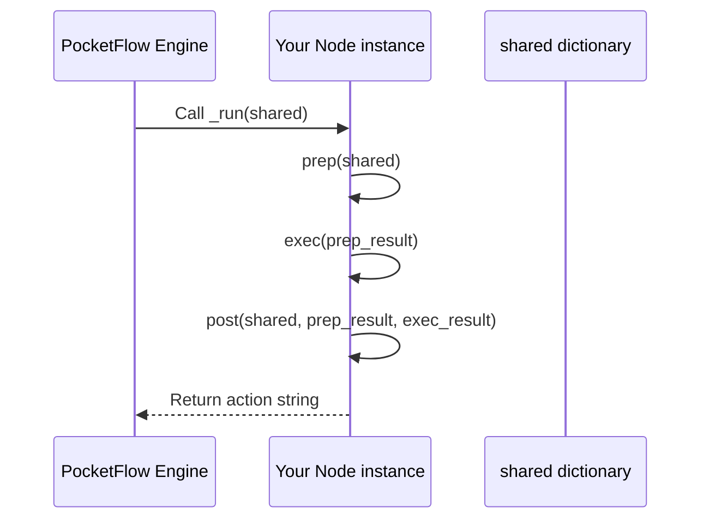

# Chapter 3: Nodes (`BaseNode`, `Node`, `AsyncNode`)

Welcome back! In the last chapter, we explored the **Shared State (`shared` dictionary)** and saw how it acts like a common notebook for different parts of your workflow to talk to each other. Now, it’s time to meet the main **workers** in PocketFlow that do the actual tasks: the **Nodes**.

---

## Why Nodes? The Tiny Workers of Your AI Workflow

Imagine you want to build an AI that can:

1. Read a user’s question.
2. Search the web for answers.
3. Summarize those answers.

Each of these is a separate, simple job. But how do you organize this in your code? You want each job to do *just one thing* well — and be easy to manage.

**That’s where Nodes come in!**

Nodes are the individual workers in PocketFlow. Each Node:

- Does one small task, like searching or summarizing.
- Knows how to get its inputs from the `shared` dictionary.
- Carries out its task.
- Puts its results back into `shared`.
- Tells the workflow what to do next.

They’re like specialized assembly line workers, each focusing on one job. Some work step-by-step (synchronously), and some wait for external events like web responses without blocking (asynchronously).

---

## The Three-Step Life of a Node: `prep`, `exec`, and `post`

Every Node follows a simple lifecycle with three steps:

| Step   | What It Does                           | Analogy                              |
|--------|-------------------------------------|------------------------------------|
| `prep` | Gather inputs from the shared dictionary | Worker picking up tools from a bench |
| `exec` | Perform the core task (e.g., search) | Worker doing their specialized job  |
| `post` | Save results back to shared & decide next action | Worker placing the finished part on conveyor and signaling where it goes next |

Let’s look at each step in more detail.

---

### 1. `prep(self, shared)`

- **Purpose:** To get everything the Node needs from the shared dictionary before starting work.
- **Input:** The shared dictionary (our communal notebook).
- **Output:** The prepared inputs for the core task.

**Example:**

```python
def prep(self, shared):
    # Grab the user's question from shared
    question = shared.get("question", "")
    return question
```

*Here, the Node grabs the question it will work on.*

---

### 2. `exec(self, prep_res)`

- **Purpose:** This is the heart of the Node—it does the actual task.
- **Input:** The prepared inputs from `prep`.
- **Output:** The result of the task (e.g., search results or a summary).

**Example:**

```python
def exec(self, question):
    # Pretend to search the web
    results = f"Fake search results for '{question}'"
    return results
```

*Here, the Node “searches” (pretends), based on the question.*

---

### 3. `post(self, shared, prep_res, exec_res)`

- **Purpose:** After the task, save the results back into `shared` and decide what to do next.
- **Inputs:** 
  - The shared dictionary (so it can be updated), 
  - The prep results, 
  - The execution results.
- **Output:** An **action string** telling the Flow what to do next (or `None` to go with a default action).

**Example:**

```python
def post(self, shared, prep_res, exec_res):
    # Store the search results in shared
    shared["search_results"] = exec_res
    # Return the action string 'found' to tell Flow what to do next
    return "found"
```

*The Node saves its output and chooses the next step.*

---

## A Tiny Real Example: A Search Node

Here’s a small Node that does all three steps together:

```python
class SearchNode:
    def prep(self, shared):
        return shared.get("question", "")

    def exec(self, question):
        return f"Search results for: '{question}'"

    def post(self, shared, prep_res, exec_res):
        shared["search_results"] = exec_res
        return "next"
```

**Running this Node on `shared = {"question": "What is AI?"}` will:**

- `prep` gets `"What is AI?"`
- `exec` produces `"Search results for: 'What is AI?'"`  
- `post` saves this under `"search_results"` and says `"next"` for the next Node to execute.

---

## Different Kinds of Nodes: `BaseNode`, `Node`, and `AsyncNode`

PocketFlow offers three main types of Nodes, with some extra features:

| Node Type  | Sync / Async | What It Does                                         | Why Use It?                                           |
|------------|--------------|-----------------------------------------------------|------------------------------------------------------|
| `BaseNode` | Synchronous  | Basic Node with `prep()`, `exec()`, and `post()`     | The simplest, basic worker you extend yourself.       |
| `Node`     | Synchronous  | Like BaseNode, but with automatic retries & fallback | For stable synchronous tasks that might sometimes fail (e.g., API calls). |
| `AsyncNode`| Asynchronous | Same as Node but supports async methods and `await`  | For tasks that need to wait (e.g., web requests) without freezing the program.|

### What does “asynchronous” mean?

When a task might take a while (like a web search), an `AsyncNode` can *pause* while waiting and let the rest of the program *keep running*. This makes your AI workflow faster and more efficient!

You don’t have to know all the details now — we’ll cover async Nodes deeply in [Chapter 7: Asynchronous Processing](07_asynchronous_processing_and_asyncnode_asyncflow_.md).

---

## How a Node Runs Behind the Scenes: Step-by-Step

Let’s imagine you have a Flow that needs to run a Node named `SearchNode`. Here’s what happens when the workflow calls the Node to run:



- The Flow asks the Node to **run** by calling its internal `_run()` method.
- The Node does its three steps: `prep`, `exec`, and `post`.
- `post` updates `shared` and returns an **action** string like `"next"` or `"done"`.
- The Flow uses the action to decide the next Node to run.

---

## What Happens Inside the Code? A Peek

A minimalist example of the Node’s internal run method looks like this:

```python
class BaseNode:
    def _run(self, shared):
        prep_result = self.prep(shared)
        exec_result = self.exec(prep_result)
        action = self.post(shared, prep_result, exec_result)
        return action
```

For `Node` (which extends `BaseNode`), the `exec` part is a little more robust:

```python
class Node(BaseNode):
    def _exec(self, prep_res):
        for try_num in range(self.max_retries):
            try:
                return self.exec(prep_res)
            except Exception:
                # retry logic here (wait and try again)
                pass
        # Fallback if all retries fail
        return self.exec_fallback(prep_res, exc)
```

This code means your Node tries its core task (`exec`) multiple times if needed. If it keeps failing, it calls a fallback to avoid crashing.

---

## Putting It All Together: How Nodes Fit in Your Workflow

Remember from previous chapters:

- Nodes **read and write** from the `shared` dictionary.
- Nodes **return an action string** to tell the Flow what to do next.
- Flows use these actions to **chain** Nodes together.

This modular design lets you build complex AI processes by connecting a series of simple Nodes, each doing one job, working together smoothly.

---

## Summary

In this chapter, you learned:

- **What Nodes are:** Tiny, specialized workers in PocketFlow doing one task each.
- **The three phases inside every Node:** `prep` (gather input), `exec` (perform task), and `post` (save outputs + choose next step).
- The difference between `BaseNode` (basic worker), `Node` (sync with retries), and `AsyncNode` (async tasks).
- How a Node runs internally when the Flow engine calls it.
- Why Nodes keep your AI workflows modular, manageable, and reusable.

---

## What’s Next?

Now that you understand Nodes — the heart of PocketFlow’s work — it’s time to see **how Nodes communicate through actions and transitions** to form bigger workflows.

Check out the next chapter: [Chapter 4: Actions and Transitions in Workflows](04_actions_and_transitions_in_workflows_.md)

---

Thanks for learning with us! PocketFlow’s building blocks are becoming clearer and you’re ready to create smarter AI workflows step-by-step.

---

Generated by [AI Codebase Knowledge Builder](https://github.com/The-Pocket/Tutorial-Codebase-Knowledge)