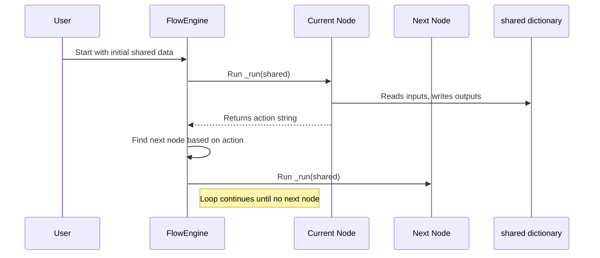

# Chapter 4: Actions and Transitions in Workflows

Welcome back! In the last chapter, you learned about the important role of [Nodes (`BaseNode`, `Node`, `AsyncNode`)](03_nodes___basenode____node____asyncnode___.md)—the tiny workers that do tasks—and how they share data through the `shared` dictionary. Now, it’s time to learn **how these Nodes talk to each other and decide what happens next**. This is where **Actions and Transitions** come in.

---

## Why Actions and Transitions Matter: The “Choose Your Own Adventure” Analogy

Imagine you're reading a "Choose Your Own Adventure" book. At the end of each page, you see options like:

- If you decide to open the door, turn to page 42.
- If you want to look under the bed, turn to page 55.

In this story:

- Your **choice** is the **Action**.
- The **page number you turn to next** is the **Transition**.

Just like the story changes depending on what you choose, workflows in PocketFlow use **actions** to decide what to do next—and **transitions** map those actions to the next steps.

---

## What Are Actions and Transitions in PocketFlow?

### **Action**

- A **string** returned by a Node after it finishes its work.
- Represents what happened or what the Node wants to do next.
- Examples: `"search"`, `"answer"`, `"retry"`, `"done"`.

### **Transition**

- A **rule inside a Flow** that connects one Node to another.
- Says: “If the current Node returns action X, then run Node Y next.”
- Syntax example (more below): `decide_node - "search" >> search_node`.

---

## How Actions and Transitions Work Together — A Simple Example

Let’s build a tiny workflow that decides what to do based on the user’s question.

### Step 1: A Node Returns an Action

```python
class DecideNode:
    def run(self, shared):
        question = shared.get("question", "")
        if "weather" in question.lower():
            return "search"  # Action: call the SearchNode next
        else:
            return "answer"  # Action: call the AnswerNode next
```

- Here, `DecideNode` checks the question.
- If it contains “weather,” it returns `"search"`.
- Otherwise, it returns `"answer"`.

### Step 2: Connect Nodes with Transitions

Now, imagine we have two more Nodes:

```python
class SearchNode:
    def run(self, shared):
        shared["result"] = "Fake weather search results"
        return "done"

class AnswerNode:
    def run(self, shared):
        shared["result"] = "Direct answer generated"
        return "done"
```

We connect them using transitions like this:

```python
decide = DecideNode()
search = SearchNode()
answer = AnswerNode()

# Connect transitions:
decide - "search" >> search
decide - "answer" >> answer
```

- When `decide` returns `"search"`, the `search` Node runs next.
- When `decide` returns `"answer"`, the `answer` Node runs next.

### What is Happening Here?

- Nodes return **actions** — strings telling what should happen next.
- The Flow uses **transitions** to map these actions to specific Nodes.

This way, your workflow can decide dynamically where to go next!

---

## Default Transitions — What if No Action Is Matched?

Sometimes, a Node might return `None` or an unexpected action. What then?

- You can define a **default transition** for a Node.
- This works like a “catch-all” route when no specific action rule matches.

### Syntax for Default Transition

```python
decide >> answer  # If no action matches from 'decide', go to 'answer' by default
```

---

## How to Define Transitions Using Nice Python Syntax

PocketFlow uses a clever, easy-to-read syntax to define transitions:

- `node - "action" >> next_node`  
  Means: If `node` returns `"action"`, then run `next_node` next.

- `node >> next_node`  
  Means: The default transition — if no other action matches, go to `next_node`.

---

## A Mini Flow Putting It All Together

```python
class DecideNode:
    def run(self, shared):
        question = shared.get("question", "").lower()
        if "weather" in question:
            return "search"
        else:
            return "answer"

class SearchNode:
    def run(self, shared):
        shared["result"] = "Weather info from search"
        return "done"

class AnswerNode:
    def run(self, shared):
        shared["result"] = "Direct answer"
        return "done"

# Create nodes
decide = DecideNode()
search = SearchNode()
answer = AnswerNode()

# Define transitions
decide - "search" >> search
decide - "answer" >> answer
search >> None      # No next node: flow ends after search
answer >> None      # No next node: flow ends after answer

# Imagine running the flow starting with decide node:
shared = {"question": "What is the weather today?"}
current_node = decide

while current_node:
    action = current_node.run(shared)
    # Find the next node based on action
    next_node = current_node.successors.get(action) or current_node.successors.get("default")
    current_node = next_node

print(shared["result"])  # Output: Weather info from search
```

**What happens here?**

- `decide` sees that question contains `"weather"` and returns `"search"`.
- Flow looks up `"search"` in `decide.successors` and finds `search` node.
- Runs `search`, which writes results to `shared` and returns `"done"`.
- `search` has no transition for `"done"` or default, so flow ends.
- Finally, print the result.

---

## What Happens Inside PocketFlow? (Step-by-Step)



**Explanation:**

1. You start the workflow with some initial data in `shared`.
2. The Flow runs the current Node’s `_run` method (which calls its `run()` method internally).
3. The Node reads and writes data to `shared`, then returns an **action string**.
4. The Flow checks the `successors` of that Node to find which Node to run next for that action.
5. It moves to the next Node and repeats.
6. When no next Node is found for an action, the workflow ends.

---

## Under The Hood: How Does PocketFlow Store and Use Transitions?

Each Node holds a dictionary called `successors`:

- The keys are action strings.
- The values are the next Nodes to run.

When you do this:

```python
decide - "search" >> search
```

Underneath, PocketFlow does this:

```python
decide.successors["search"] = search
```

If you do a default transition like:

```python
decide >> answer
```

It stores:

```python
decide.successors["default"] = answer
```

---

### How is that fancy syntax implemented? (Simplified)

PocketFlow uses Python's special methods `__sub__` (`-`) and `__rshift__` (`>>`) to create a neat, readable syntax.

```python
class BaseNode:
    def __sub__(self, action_str):
        # Returns a helper object that stores the action string and source node
        return _ConditionalTransition(self, action_str)

    def __rshift__(self, next_node):
        # Defines a default transition (action="default")
        return self.next(next_node)

    def next(self, node, action="default"):
        self.successors[action] = node
        return node

class _ConditionalTransition:
    def __init__(self, src_node, action_name):
        self.src_node = src_node
        self.action_name = action_name

    def __rshift__(self, target_node):
        # Actually registers the transition
        return self.src_node.next(target_node, self.action_name)
```

This means:

- When you write `decide - "search"`, Python calls `decide.__sub__("search")`, which gives a helper object.
- Then when you write `>> search`, Python calls that helper’s `__rshift__` with `search`.
- The helper tells `decide` to set `"search"` action to go to the `search` Node.

This makes the code clean and easy to read!

---

## Summary

In this chapter, you learned:

- **What are Actions and Transitions?**  
  Actions are signals returned by Nodes; transitions map actions to the next Nodes.

- **Why use them?**  
  To **control the flow dynamically**, like a “Choose Your Own Adventure” game.

- **How to define them in PocketFlow:**  
  Use `node - "action" >> next_node` to connect Nodes based on actions, and `node >> next_node` for default transitions.

- **What happens behind the scenes:**  
  Each Node keeps a dictionary of successors keyed by action strings, used by the Flow to pick the next Node dynamically.

Actions and Transitions give your PocketFlow workflows the ability to make decisions and adapt on the fly, helping you build flexible and powerful AI pipelines.

---

## What’s Next?

Now that you understand how Nodes return actions and how Flows use transitions to decide what to do next, it’s time to learn more about the bigger picture—the **Flows (`Flow`, `AsyncFlow`)** that organize all this together.

Check out [Chapter 5: Flows (`Flow`, `AsyncFlow`)](05_flows___flow____asyncflow___.md) next!

---

Happy building with PocketFlow! Your AI workflows are becoming more dynamic and capable every step of the way.

---

Generated by [AI Codebase Knowledge Builder](https://github.com/The-Pocket/Tutorial-Codebase-Knowledge)