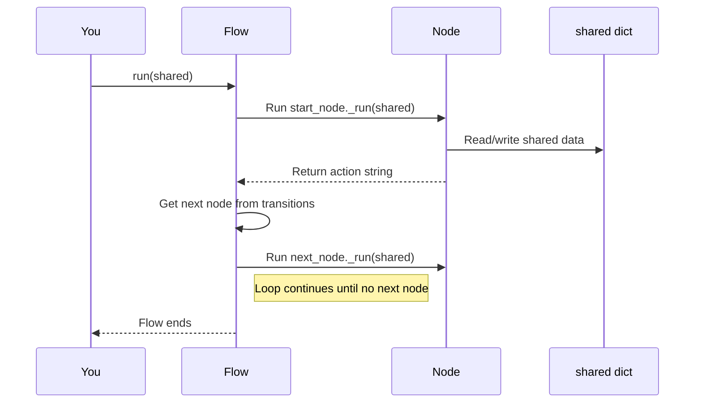

# Chapter 5: Flows (`Flow`, `AsyncFlow`)

Welcome back! In the previous chapter, [Actions and Transitions in Workflows](04_actions_and_transitions_in_workflows_.md), we learned how individual Nodes decide what should happen next by returning **actions**, and how these actions guide the transitions between Nodes.

Now, it’s time to step up to the big picture and learn about **Flows**—the cool orchestrators that manage the entire journey of your workflow. They are the directors telling **which Node runs next** based on the actions, all while passing the shared data around.

---

## Why Do We Need Flows?

Imagine you are making a sandwich. There are several steps:

1. Get the bread.
2. Add the filling you like.
3. Toast the sandwich (if you want).
4. Cut and serve.

You want these steps to happen **in order**, right? Each step might have some choices (maybe you want to skip toasting), and you want the process to flow smoothly without losing track.

**Flows** in PocketFlow are like the manager or conductor of this sandwich-making process. They:

- Make sure each **Node** (step) runs in the right sequence.
- Decide where to go next based on the action returned by the current Node.
- Pass along the shared information (`shared` dictionary) so data flows from step to step.
- Handle **synchronous** steps (one after another, waiting for each to finish) with `Flow`.
- Handle **asynchronous** steps (steps that can take time and don't block everything) with `AsyncFlow`.

In short: **Flows keep your workflow organized and running smoothly.**

---

## Key Concepts: Breaking Down Flows

Let’s understand the important parts of Flows step-by-step:

### 1. The Start Node

Every Flow begins with a **start Node**. This is the first step your workflow executes.

### 2. Running a Node

The Flow asks the current Node to run, passing it the shared state dictionary. The Node does its work, updates shared data, and returns an **action** string.

### 3. Deciding What’s Next

Based on the action string and the transitions you defined earlier (see [Chapter 4](04_actions_and_transitions_in_workflows_.md)), the Flow finds the next Node to run.

### 4. The Loop Continues

The Flow repeats this process—running nodes one by one, deciding the next based on the action—until no next node is found. Then, the Flow stops.

### 5. `Flow` vs. `AsyncFlow`

- **`Flow`** handles *synchronous* Nodes that run one after another, **blocking** until complete.
- **`AsyncFlow`** supports *asynchronous* Nodes (`AsyncNode`s), allowing the workflow to **pause and wait** on tasks like network calls or user inputs *without freezing* the entire program.

---

## A Simple Example: Making a Mini Text Workflow Using `Flow`

Imagine we want a simple workflow that:

1. Takes an input sentence.
2. Converts it to uppercase.
3. Prints the result.
4. Ends.

### Step 1: Define Nodes

```python
class InputNode:
    def run(self, shared):
        shared["text"] = "hello world"  # Pretend user input
        return "next"

class UppercaseNode:
    def run(self, shared):
        shared["text"] = shared["text"].upper()
        return "next"

class PrintNode:
    def run(self, shared):
        print(shared["text"])  # Prints HELLO WORLD
        return None  # No action means end of flow
```

> Here, each Node does one simple job and returns an action or None if it ends.

### Step 2: Create Instances

```python
input_node = InputNode()
uppercase_node = UppercaseNode()
print_node = PrintNode()
```

### Step 3: Define Transitions (From Actions to Next Nodes)

```python
input_node - "next" >> uppercase_node
uppercase_node - "next" >> print_node
print_node >> None  # No next node, flow ends.
```

### Step 4: Create and Run the Flow

```python
from pocketflow import Flow

my_flow = Flow(start=input_node)

shared = {}
my_flow.run(shared)
```

**What happens here?**

- Flow starts with `input_node`.
- `input_node` puts `"hello world"` in shared and returns `"next"`.
- Flow runs `uppercase_node` next, which uppercases the text and returns `"next"`.
- Flow runs `print_node` next, which prints the uppercase text and returns `None`, stopping the flow.

---

## What Happens Inside a Flow When You Run It?

Let's visualize the process with a simple diagram.



**Step-by-step:**

1. You start the Flow with some `shared` data.
2. Flow runs the current Node’s `_run` method (which calls `prep`, `exec`, `post` internally).
3. The Node reads and writes data to `shared` and returns an action string.
4. Flow looks up the next Node for that action.
5. The next Node runs, repeating the cycle.
6. If no next Node is found for that action, the flow ends.

---

## Peek Into the Flow Code (Simplified)

Here is a basic idea of what the Flow’s orchestration code looks like inside (you don’t need to write this yourself):

```python
class Flow:
    def __init__(self, start):
        self.start_node = start

    def get_next_node(self, current_node, action):
        # Look up successor node for the action
        return current_node.successors.get(action) or current_node.successors.get("default")

    def run(self, shared):
        current = self.start_node
        while current:
            action = current._run(shared)  # Run the current node
            current = self.get_next_node(current, action)
```

- It loops until there’s no next node.
- Uses the Node’s `successors` dictionary (set by transitions like `node - "action" >> next_node`) to pick the next Node.

---

## What About AsyncFlow?

Sometimes, your Nodes might need to wait for things like web requests, user input, or delays. You don’t want everything to freeze while waiting!

That’s why PocketFlow also offers **`AsyncFlow`**, which works with **`AsyncNode`s**—Nodes that can pause and resume using Python’s `async` and `await`.

### How is AsyncFlow Different?

- It runs **asynchronously** using `async def` and `await`.
- When running an `AsyncNode`, it `await`s the node’s `_run_async()` method.
- Otherwise, for synchronous Nodes, runs `_run()` normally.
- This allows your app to remain responsive and efficient.

### Tiny AsyncFlow Example (Conceptual):

```python
from pocketflow import AsyncFlow

async def run_async_flow():
    my_async_flow = AsyncFlow(start=some_async_node)
    shared = {}
    await my_async_flow.run_async(shared)
    print("Async flow completed!")

# You’d run this in an async environment, e.g., using asyncio.run(run_async_flow())
```

We’ll dive deeper into async processing in the upcoming [Chapter 7: Asynchronous Processing and AsyncNode/AsyncFlow](07_asynchronous_processing_and_asyncnode_asyncflow_.md).

---

## Nested Flows: Flows Within Flows

Flows can even be nested! This means you can treat an entire Flow like a Node inside another Flow.

This is useful when building big applications with multiple layers:

- One Flow manages the main workflow.
- That Flow calls another smaller Flow as a single step.
- This makes complex systems easier to design, maintain, and reuse.

### Conceptual Example:

```python
inner_flow = Flow(start=some_node)
supervisor_node = SupervisorNode()

inner_flow >> supervisor_node  # After inner flow finishes, go to supervisor

outer_flow = Flow(start=inner_flow)
```

Here, `inner_flow` runs completely first, then the `supervisor_node` runs.

---

## Summary: What You Learned in This Chapter

- **Flows** are the orchestrators managing the order of Nodes in your workflow.
- They run Nodes one by one, passing the `shared` dictionary, getting actions, and using transitions to pick the next Node.
- `Flow` works with synchronous Nodes, running one after another in a blocking way.
- `AsyncFlow` works with asynchronous Nodes, using `async`/`await` to keep your program responsive.
- Flows can be nested—treating an entire Flow as a Node inside a bigger Flow.
- This orchestration model lets you build complex, dynamic AI workflows with clarity and modularity.

---

## What’s Next?

Now that you understand how Flows manage your AI workflows at a big scale, our next chapter will take a closer look at **asynchronous operations** — how to write Nodes and Flows that can handle real-world waiting tasks gracefully.

Check out [Chapter 7: Asynchronous Processing and AsyncNode/AsyncFlow](07_asynchronous_processing_and_asyncnode_asyncflow_.md) to learn more!

---

Welcome to the exciting world of building smart, scalable AI workflows with PocketFlow!

---

Generated by [AI Codebase Knowledge Builder](https://github.com/The-Pocket/Tutorial-Codebase-Knowledge)