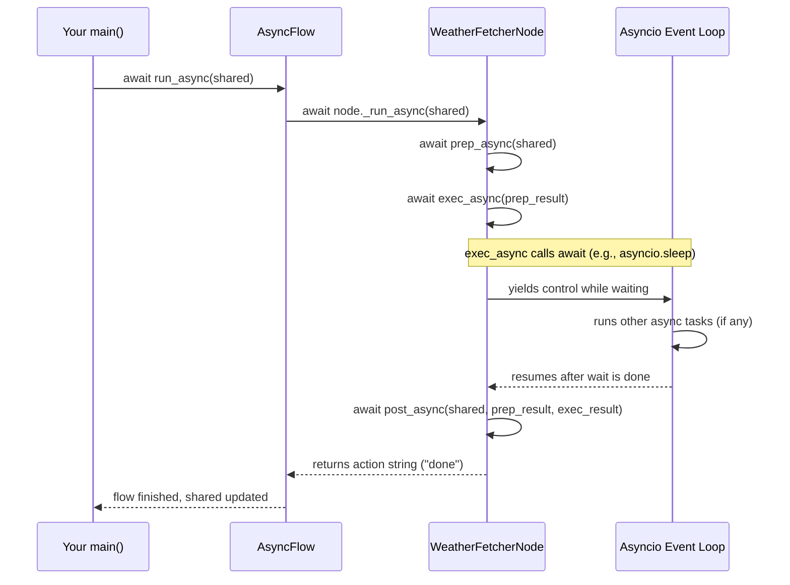

# Chapter 7: Asynchronous Processing and AsyncNode/AsyncFlow

Welcome back! In the previous chapter, we learned about [Batch Processing in PocketFlow](06_batch_processing_in_pocketflow_.md), which helps you run many similar tasks efficiently. Now, let's explore an important concept that makes your workflows **fast and responsive** — **Asynchronous Processing** — and how PocketFlow’s **AsyncNode** and **AsyncFlow** make it easy.

---

## Why Asynchronous Processing? — The Chef Analogy

Imagine a chef in a busy kitchen.

- A **synchronous chef** cooks one dish at a time. They chop veggies, put the pot on the stove, then just **stand and wait** for the food to cook before moving on.
- An **asynchronous chef** is smarter. They chop veggies, start simmering the pot, and *while waiting*, prepare another dish. They switch between tasks during waiting periods, getting more done without idle time.

Programs work the same way! Many AI workflows involve **waiting** for slow things like internet calls or user input. If the program waits *synchronously*, it freezes and can’t do anything else.

**Asynchronous processing lets your program start a task and "pause" it while waiting**, doing other useful work in the meantime.

---

## What Is Asynchronous Processing in PocketFlow?

PocketFlow’s `AsyncNode` is like the asynchronous chef — it lets you write Nodes whose tasks can wait without freezing the whole workflow.

- `AsyncNode`s use Python’s async features: **`async`** and **`await`** keywords.
- `AsyncFlow` is the manager that runs these async Nodes smoothly, making sure everything happens in order while keeping your program responsive.

---

## A Simple Use Case: Fetch Weather Information

Imagine you want to build a workflow that:

1. Takes a city name from the user.
2. Calls a weather API to get current weather (which takes time).
3. Saves the weather info and ends.

If you wrote this synchronously, your program would “pause” and look frozen while waiting for the API.

Using asynchronous processing, your program can keep doing other things, like handling user input or running other tasks, **without waiting idly**.

---

## Meet the `AsyncNode`: Your Async Worker

An `AsyncNode` is like a regular Node but uses **`async def`** methods:

- `prep_async(self, shared)` — prepare inputs (async)
- `exec_async(self, prep_res)` — do the actual work (async)
- `post_async(self, shared, prep_res, exec_res)` — save results and decide next step (async)

Inside these methods, you can write `await`-calls to asynchronous functions such as making real HTTP requests.

---

### Minimal Example: Async Weather Fetcher Node

```python
import asyncio
from pocketflow import AsyncNode

class WeatherFetcherNode(AsyncNode):
    async def prep_async(self, shared):
        city = shared.get("city_name", "Unknown")
        return city

    async def exec_async(self, city):
        await asyncio.sleep(2)  # Simulate waiting for API call
        return f"Sunny in {city}"

    async def post_async(self, shared, prep_res, exec_res):
        shared["weather_report"] = exec_res
        return "done"
```

**Explanation:**

- We pretend to fetch weather data with `await asyncio.sleep(2)` which waits 2 seconds **without freezing**.
- After waiting, it writes the weather result into shared data.
- Returns `"done"` as the action to finish the Flow.

---

## How to Use `AsyncFlow` to Run Async Nodes

To run async Nodes, you use `AsyncFlow` instead of synchronous `Flow`.

### Step 1: Create Node & Flow

```python
weather_node = WeatherFetcherNode()
from pocketflow import AsyncFlow
weather_flow = AsyncFlow(start=weather_node)
```

### Step 2: Run the Flow Inside an `async` Function

```python
import asyncio

async def main():
    shared = {"city_name": "London"}
    await weather_flow.run_async(shared)
    print(shared["weather_report"])

asyncio.run(main())
```

---

## What Happens When You Run Async Flows?

Let’s visualize how AsyncFlow runs an AsyncNode and why it doesn't freeze your program.



**Step by step:**

1. Your app calls `await flow.run_async(shared)`.
2. `AsyncFlow` calls your async Node's `_run_async`.
3. Node runs `prep_async`, then `exec_async` (which calls `await` internally to pause for I/O).
4. While waiting, the Python event loop runs other tasks — your program stays responsive.
5. Once the wait is over, Node resumes, runs `post_async`, updates `shared`, and returns an action.
6. `AsyncFlow` recognizes the action and either moves on or ends.
7. Your app gets back control with updated `shared`.

---

## Why Is This Powerful?

Without async, your program *waits and blocks* during external calls like:

- Web API requests
- Database queries
- User input

With async, your program can:

- Handle multiple independent tasks at the same time.
- Be fast, non-blocking, and efficient.
- Be responsive and scalable.

---

## Under the Hood: PocketFlow’s AsyncNode and AsyncFlow

### How `AsyncNode` Runs Your Async Code

PocketFlow provides an internal method called `_run_async(shared)` that calls your defined `async def` methods with `await`.

Simplified:

```python
class AsyncNode:
    async def _run_async(self, shared):
        prep_res = await self.prep_async(shared)
        exec_res = await self.exec_async(prep_res)
        action = await self.post_async(shared, prep_res, exec_res)
        return action
```

This makes your async Node look like a normal synchronous Node externally, but supports `await` internally.

---

### How `AsyncFlow` Orchestrates Async Nodes

`AsyncFlow` runs Nodes one by one. If the current Node is an `AsyncNode`, it uses:

```python
action = await current_node._run_async(shared)
```

If it's a regular synchronous Node, it just calls it normally:

```python
action = current_node._run(shared)
```

After each Node finishes:

- `AsyncFlow` looks up the next Node based on the action string.
- Repeats until no next Node.
- Returns control to your app.

**Simplified snippet from AsyncFlow:**

```python
class AsyncFlow:
    async def _orch_async(self, shared):
        current = self.start_node
        while current is not None:
            if isinstance(current, AsyncNode):
                action = await current._run_async(shared)
            else:
                action = current._run(shared)
            current = self.get_next_node(current, action)
        return action
```

---

## Summary: You Learned How To...

- Understand the problem with waiting **synchronously** in programs.
- Use PocketFlow’s **`AsyncNode`** to write Node logic that can await and pause without freezing.
- Use **`AsyncFlow`** to orchestrate AsyncNodes in your asynchronous workflows.
- How async programming improves responsiveness and efficient multitasking.
- Follow the asynchronous flow of control inside PocketFlow with sequence diagrams.
- Write simple async code in PocketFlow with minimal effort!

---

## What’s Next?

You are now equipped to build fast, non-blocking AI workflows with PocketFlow! Next up, you can explore advanced features like batched parallel async processing or agent-to-agent communication.

Check out [Chapter 8: A2A (Agent-to-Agent) Communication Framework](08_a2a__agent_to_agent__communication_framework_.md) to see how PocketFlow nodes and flows communicate with external systems.

---

Welcome to the future of efficient AI pipelines — where your workflows multitask like expert chefs without ever freezing!

---

Generated by [AI Codebase Knowledge Builder](https://github.com/The-Pocket/Tutorial-Codebase-Knowledge)