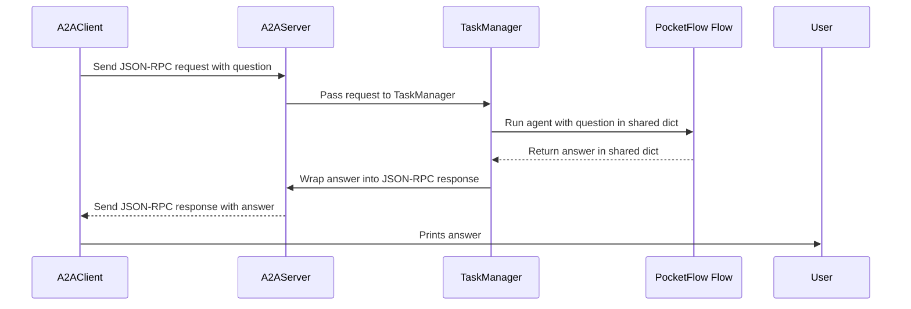

# Chapter 8: A2A (Agent-to-Agent) Communication Framework

Welcome back! Now that you’ve learned about asynchronous processing in [Chapter 7: Asynchronous Processing and AsyncNode/AsyncFlow](07_asynchronous_processing_and_asyncnode_asyncflow_.md), we’re going to take a big step forward. In this chapter, we'll explore how to make your PocketFlow agents talk to **other systems or agents** — using a common, standardized language called **A2A (Agent-to-Agent) Communication Framework**.

---

## Why Do We Need A2A?

Imagine you built a really smart PocketFlow agent that can:

- Answer questions,
- Search the web,
- Summarize information.

Great! But what if:

- Another app somewhere else wants to ask your agent a question?
- You want to offer your agent as a service for other AI programs to use?
- Multiple agents should collaborate and share tasks easily?

You need a **standard way for agents to talk to each other** — no matter how they’re built internally.

That’s exactly what the **A2A Communication Framework** does! It wraps your PocketFlow agent so it can:

- Speak a common language with other agents,
- Receive questions from external systems,
- Send back answers,
- Collaborate seamlessly.

---

## The Central Use Case: Making Your Agent a Friendly Neighbor

Say you built an agent in PocketFlow that answers questions about "PocketFlow" itself. With A2A, you can:

- Host your agent on a local server.
- Use a special client program elsewhere to **call** your agent with a question like:  
  _"What is PocketFlow?"_
- Your agent answers back with a helpful text.

All using a **standard protocol** called **JSON-RPC**, wrapped inside the PocketFlow A2A framework.

---

## Key Pieces of the A2A Framework – Breaking It Down

The A2A Framework is composed of several important parts, each playing a role like parts in a phone call system:

| Component    | What It Does                                  | Analogy                |
|--------------|----------------------------------------------|------------------------|
| **A2AServer**  | Hosts your PocketFlow agent, listens for incoming requests | Receptionist answering calls |
| **TaskManager**| Translates between A2A messages and PocketFlow flows | Interpreter translating languages |
| **A2AClient**  | Sends questions and receives answers from agents | Caller dialing the phone |
| **A2A JSON-RPC Protocol** | The “language” they all speak (standard messaging format) | Common language or code everyone understands |
| **Common types** | Data structures defining message formats | Dictionary of words and grammar |

Let's explore each in simple terms.

---

### 1. A2AServer: The Receptionist

Your agent needs a way to listen for incoming calls. The **A2AServer**:

- Runs an HTTP server.
- Accepts requests that follow the A2A JSON-RPC protocol.
- Passes received messages to a **TaskManager**.
- Sends responses back after the task completes.

*Think of it like a receptionist answering a phone call, passing the question inside the company.*

---

### 2. TaskManager: The Interpreter

The TaskManager is the heart translator. It:

- Receives A2A-format messages from the receptionist.
- Extracts the question text or instructions.
- Prepares the **shared dictionary** with necessary info for your PocketFlow [Flow](05_flows___flow____asyncflow___.md).
- Runs your PocketFlow agent.
- Collects the answer from the agent’s results.
- Wraps the answer back into A2A message format.

*Imagine someone who speaks both A2A language and PocketFlow’s internal language, translating back and forth.*

---

### 3. A2AClient: The Caller

The A2AClient is the one who calls your agent’s phone line. It:

- Prepares the question in the A2A format.
- Sends the request to the A2AServer over HTTP.
- Waits for and reads the answer.
- Makes it easy for other programs (or you!) to call your PocketFlow agent.

---

### 4. A2A JSON-RPC Protocol: The Common Language

This is the agreed-upon format for sending messages:

- Uses JSON format.
- Defines methods like `tasks/send` (send a new task to the agent) and `tasks/get` (fetch task status).
- Structures messages consistently with “requests” and “responses”.

*Thanks to this, every agent or client “speaks the same language” - no confusion.*

---

## How to Use A2A to Make Your Agent Talk: A Simple Example

Let’s walk through the basic steps to make a PocketFlow agent answer questions via A2A:

---

### Step 1: Create a TaskManager

The TaskManager connects the incoming A2A message to your PocketFlow flow.

Here’s a super simplified example:

```python
class SimpleTaskManager:
    def on_send_task(self, request):
        # Extract question text from A2A message
        question = request["params"]["message"]["parts"][0]["text"]
        
        # Prepare shared dict for PocketFlow
        shared = {"question": question}
        
        # Run your PocketFlow flow (pretend function)
        flow.run(shared)
        
        # Extract answer from shared
        answer = shared.get("answer", "No answer.")
        
        # Wrap answer in A2A response format
        return {
            "id": request["id"],
            "result": {
                "artifacts": [
                    {"parts": [{"type": "text", "text": answer}]}
                ]
            }
        }
```

**What happens here?**

- We get a JSON-RPC request.
- Pull out the question text.
- Run your existing PocketFlow flow with this question.
- Collect the answer from `shared`.
- Put the answer back into the response JSON format.

---

### Step 2: Host the Agent with A2AServer

Next, run a server to listen for incoming requests:

```python
from common.server import A2AServer

def start_server():
    task_manager = SimpleTaskManager()
    server = A2AServer(task_manager=task_manager, host="localhost", port=10003)
    server.start()
```

Running this starts an HTTP server on your machine that accepts A2A requests!

---

### Step 3: Use A2AClient to Ask Your Agent

From anywhere, you can send a question like this:

```python
import asyncio
from common.client import A2AClient

async def ask_agent():
    client = A2AClient(url="http://localhost:10003")
    question = "What is PocketFlow?"
    
    # Create request payload
    payload = {
        "id": "task-1",
        "message": {
            "role": "user",
            "parts": [{"type": "text", "text": question}]
        },
        "acceptedOutputModes": ["text"]
    }
    
    response = await client.send_task(payload)
    answer_part = response.result.artifacts[0].parts[0]
    print("Agent says:", answer_part.text)

asyncio.run(ask_agent())
```

**What happens?**

- Client sends JSON-RPC request with the question.
- Server receives it, runs your PocketFlow agent.
- Server sends back the answer.
- Client prints the answer.

---

## What Happens Behind the Scenes? Step-by-Step Illustrated



---

## A Peek Under the Hood: How A2AServer Handles Requests

In `common/server/server.py`, A2AServer:

- Listens on HTTP port.
- Parses incoming JSON.
- Converts JSON to Python Pydantic models.
- Routes request based on method (e.g., `tasks/send`).
- Calls your TaskManager’s handler (`on_send_task`).
- Serializes and sends back the response.

**Simplified code:**

```python
async def handle_http_request(self, request):
    data = await request.json()
    if data["method"] == "tasks/send":
        response_model = await self.task_manager.on_send_task(data)
    # Serialize and send response:
    return JSONResponse(response_model.dict())
```

---

## Internals of TaskManager’s `on_send_task`

In your `PocketFlowTaskManager` (based on `InMemoryTaskManager`), this method will:

- Extract question text from the A2A message parts.
- Create a PocketFlow `shared` dictionary.
- Run your PocketFlow agent’s flow with this `shared`.
- Retrieve the answer from `shared`.
- Build A2A `Task` and `Artifact` objects to include the answer.
- Update task status to COMPLETED.
- Return a `SendTaskResponse`.

This is the bridge between **A2A messages** and **PocketFlow’s internals**.

---

## Why Use A2A?

- **Interoperability:** Your agent can be called by any system that speaks JSON-RPC A2A.
- **Modularity:** It separates your AI logic (PocketFlow) from the communication details.
- **Scalability:** Easily add more agents or clients speaking the same protocol.
- **Extendability:** Add new features like streaming responses or multi-step task tracking.

---

## Summary: What You Learned in This Chapter

- The **A2A Framework** lets PocketFlow agents talk to other apps or agents with a **standard JSON-RPC protocol**.
- Main components:
  - **A2AServer:** Listens for incoming calls.
  - **TaskManager:** Translates between A2A messages and PocketFlow flows.
  - **A2AClient:** Sends questions and receives answers.
  - **A2A JSON-RPC:** The “language” spoken by all.
- You can wrap your existing PocketFlow agent to become an A2A-compatible global citizen.
- The framework handles all the networking and message translation, so you focus on your AI logic.

---

## What’s Next?

This concludes our PocketFlow beginner-friendly tutorial series! You have traversed the whole path from building single AI tasks with **Nodes**, organizing them with **Flows**, handling batches and async tasks, to now making your agents **talk to other systems**!

Feel free to revisit previous chapters and start building your own intelligent modular AI workflows that integrate seamlessly in the broader AI ecosystem!

---

Welcome to the world of interoperable AI agents. Happy PocketFlow building!

---

Generated by [AI Codebase Knowledge Builder](https://github.com/The-Pocket/Tutorial-Codebase-Knowledge)