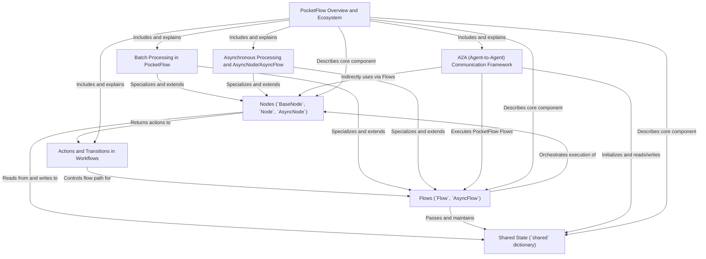

# Tutorial: PocketFlowDocs

PocketFlow is a *Python framework* designed to build modular AI workflows by connecting individual **Nodes**—atomic task units—within orchestrating **Flows**.  
These **Flows** guide the execution order based on **Actions** returned by the Nodes, while data is continuously passed and shared through a central **shared dictionary**.  
PocketFlow supports advanced needs like **asynchronous processing** for efficient I/O operations, **batch processing** to handle multiple items or repeated workflows, and an **A2A Communication Framework** enabling agents to communicate with other systems via a standardized JSON-RPC protocol.  
This modular design allows developers to create flexible, scalable, and interoperable AI applications easily.

**Source Repository:** [None](None)

## Chapters

1. [PocketFlow Overview and Ecosystem
](01_pocketflow_overview_and_ecosystem_.md)
2. [Shared State (`shared` dictionary)
](02_shared_state___shared__dictionary__.md)
3. [Nodes (`BaseNode`, `Node`, `AsyncNode`)
](03_nodes___basenode____node____asyncnode___.md)
4. [Actions and Transitions in Workflows
](04_actions_and_transitions_in_workflows_.md)
5. [Flows (`Flow`, `AsyncFlow`)
](05_flows___flow____asyncflow___.md)
6. [Batch Processing in PocketFlow
](06_batch_processing_in_pocketflow_.md)
7. [Asynchronous Processing and AsyncNode/AsyncFlow
](07_asynchronous_processing_and_asyncnode_asyncflow_.md)
8. [A2A (Agent-to-Agent) Communication Framework
](08_a2a__agent_to_agent__communication_framework_.md)

---

Generated by [AI Codebase Knowledge Builder](https://github.com/The-Pocket/Tutorial-Codebase-Knowledge)